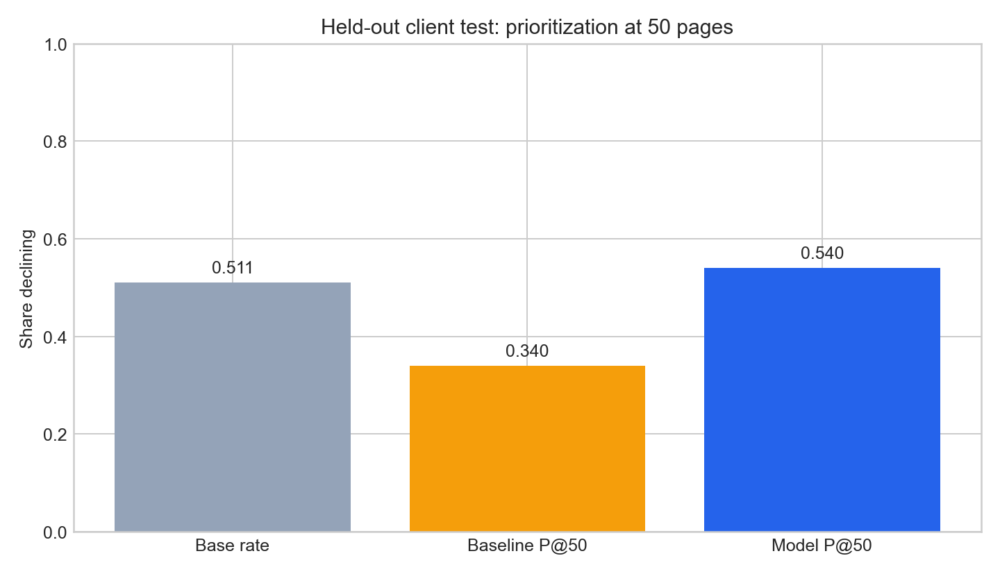
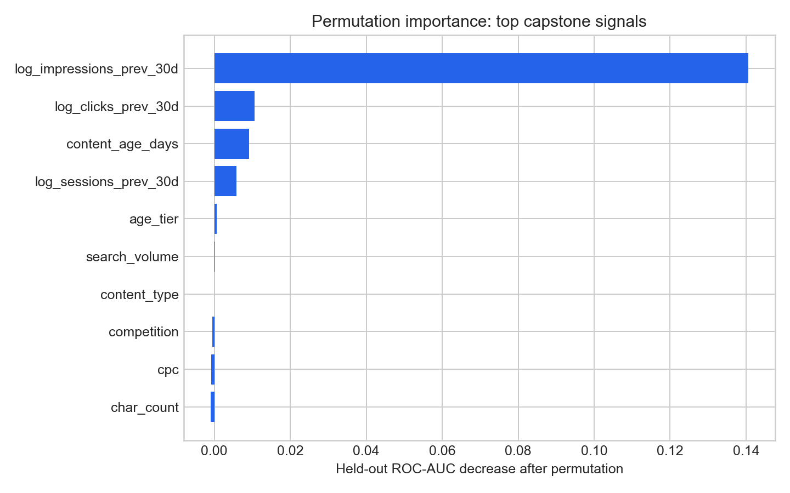

# Can Prior-Window Signals Improve Content Refresh Prioritisation?

| Item | Detail |
|---|---|
| **Author** | Umer Sajid |
| **Lane** | Refresh / Content Opportunity Scoring |
| **Repository** | [UmerSajid842/flyrankmlproject](https://github.com/UmerSajid842/flyrankmlproject) |
| **Date** | 12 August 2026 |

## Abstract

This capstone asks whether an SEO or content editor can use page context and prior-month signals to prioritise a review queue for potentially declining content. It uses the bundled anonymised FlyRank ML Internship starter release, a 30,000-page snapshot across 32 pseudonymised clients, and evaluates transfer on seven entirely held-out clients. A leakage-aware random-forest model uses only stable or prior-window signals and is compared with a transparent visibility, freshness, and content-thinness baseline on the same test split. The model achieved **Precision@50 = 0.540** versus **0.340** for the baseline, although the held-out decline base rate of 0.511 means this is a modest prioritisation result rather than an automated-action threshold. The output is a ranked **review-for-refresh** queue for directional decision support, not a causal estimate, a guarantee of traffic recovery, or a claim about Google's algorithm.

## 1. Introduction and problem statement

Content teams commonly have more ageing pages than they can review in a single editorial cycle. This capstone supports one narrow operational decision: **which pages should an editor investigate first when refresh capacity is limited?** The unit of analysis is one pseudonymised content page, and the output is a ranked review queue rather than an automated intervention. A false positive consumes an editor's review time, while a false negative leaves a potentially declining page outside the first review batch.

The target is an **observed current-snapshot decline proxy**: `trend_direction == "down"`. In the starter release, this is defined when impressions in the most recent 30 days are more than 20% below the preceding 30 days. The primary success criterion is Precision@50 on held-out clients, reported alongside the held-out decline prevalence. ROC-AUC and average precision are supplementary discrimination metrics.

## 2. Data and public-safety boundary

The analysis uses the repository's **bundled anonymised starter release**: `data/raw/content_refresh_anonymized.csv`. It is one denormalised snapshot table with **30,000 content-page rows, 44 columns, and 32 pseudonymised clients**. All activity totals cover a trailing 90-day export window. For the trend comparison, `*_prev_30d` represents days 31–60 before export and `*_last_30d` represents the most recent 30 days. This project does **not** use the separate full warehouse release or any raw client export. [1]

| Data choice | Treatment in this capstone | Reason |
|---|---|---|
| Page and client identifiers | Used only for output reference and client-grouped evaluation; never model features | Avoids memorising pseudonymised identities |
| Prior-window activity | Prior 30-day impressions, clicks, and sessions are eligible features | These measurements precede the target window |
| Context and freshness | Search context, content length, content age, days since update, and categorical tiers are eligible | They are stable context or non-overlapping signals |
| Latest-window activity | All `*_last_30d` fields are excluded | They overlap the label period |
| Labels and label components | `trend_direction`, `trend_pct`, and `is_declining_label` are excluded | They directly define the outcome |
| 90-day totals and derived rates | Excluded | They overlap the recent outcome period |
| Provider and model metadata | Excluded | They are not meaningful decision inputs for this task |

No client names, domains, live URLs, page titles, private queries, credentials, or raw exports are published. Missing numeric values are median-imputed with missingness indicators. Missing categorical values are represented as `missing`, so absent measurement is not silently converted into a genuine zero.

## 3. Methodology

### Assumptions and feature policy

The approach assumes that preceding-month visibility, freshness, content age, content characteristics, and safe search-context signals can help triage pages for review. It does **not** assume that these signals cause a decline or that a refresh will restore traffic. Numeric model inputs include search-volume context, competition, CPC, word and character counts, log-transformed prior-month impressions/clicks/sessions, content age, and days since last update. Categorical inputs include competition level, content type, main intent, and age, freshness, and length tiers.

### Label, baseline, and model

The label is the observed decline proxy `trend_direction == "down"`. The transparent baseline uses the following label-free score:

`0.50 × percentile(log(1 + prior-month impressions)) + 0.30 × percentile(days since last update) + 0.20 × content thinness`.

The learned comparator is a random-forest classifier with 300 trees, class balancing, median numeric imputation with missingness indicators, and one-hot encoding for categorical fields. Both approaches are evaluated on exactly the same held-out pages.

### Validation and leakage checks

The validation design is a client-grouped holdout: `GroupShuffleSplit` holds out 20% of clients using random seed 42. This produces 25 training clients and seven held-out clients, containing 23,837 training rows and 6,163 held-out rows. Holding out complete clients tests transfer to a portfolio not observed during training. The feature policy excludes the label, its components, all recent-30-day signals, all 90-day totals/rates, IDs, and provider/model metadata before fitting.

## 4. Results

The analysis was freshly run with `python work/scripts/run_capstone.py` on the bundled anonymised release. The table compares the baseline and random forest on the **same seven held-out clients**.

| Measure | Result |
|---|---:|
| Held-out decline base rate | 0.511 |
| Baseline Precision@50 | 0.340 |
| Model Precision@50 | **0.540** |
| Baseline Precision@100 | 0.340 |
| Model Precision@100 | **0.460** |
| Model ROC-AUC | 0.659 |
| Model average precision | 0.616 |

The model identifies 27 pages labelled `down` among its first 50 recommendations, compared with 17 for the transparent baseline. This is a 20-percentage-point improvement in Precision@50 over the selected baseline. However, Precision@50 is only slightly above the 0.511 test prevalence, so the result is a measured ranking improvement rather than evidence that the top-ranked pages should be refreshed automatically.



> **Figure 1.** At a 50-page review capacity, the model achieved Precision@50 of 0.540 versus 0.340 for the transparent baseline. The held-out base rate is displayed to put the result in context.

Permutation importance on held-out clients shows that `log_impressions_prev_30d` contributes the most measurable discrimination; permuting it reduces ROC-AUC by about 0.141. Prior-month clicks, content age, and prior-month sessions contribute much smaller incremental changes. This is a model-dependence result, not causal evidence that prior impressions produce a decline.



> **Figure 2.** Prior-month visibility dominates the feature-importance profile in this held-out split. Contextual fields with near-zero or negative importance did not materially improve discrimination after prior-window visibility was included.

## 5. Limitations and honest framing

The target describes an observed within-snapshot movement, not a future traffic forecast. The data cannot show that refreshing a page causes traffic to recover; that claim would require a controlled intervention or causal design. A single client-grouped holdout is a useful transfer test, but it is not a full multi-period, time-aware validation programme. Finally, the held-out prevalence is high, so the model's improvement over prevalence is modest despite its clear improvement over the transparent baseline.

> **Claims boundary.** Findings in this capstone are **observed, measured, directional, and decision-support only**. They do not prove Google's ranking algorithm, identify private clients, establish causal refresh impact, or guarantee a recommendation outcome.

## 6. Ranked recommendations and action playbook

The model produces a local ranked queue with a model score, baseline score, and non-label reason codes. To keep the public paper safe, page-level IDs and the ranked queue file are not published. An editor using the internal queue should follow this action playbook:

| Step | Editor action | Decision boundary |
|---|---|---|
| 1. Triage | Start with the first 50 pages ranked for **review for refresh** | The score determines review order, not an automatic content change |
| 2. Diagnose | Check search intent, factual currency, query coverage, on-page quality, and technical context | Confirm an actionable issue before editing |
| 3. Choose action | Refresh, expand, rewrite, monitor, or defer according to the diagnosis | Do not assume every observed decline needs a refresh |
| 4. Record outcome | Log the chosen action and monitor subsequent performance | A later time-aware or intervention study is needed to measure impact |

The immediate recommendation is therefore **review for refresh**, not auto-refresh. The most useful extension would build a forward outcome label from the full warehouse and evaluate it with time-aware splits.

## 7. Reproducibility

The code, executed notebook, report, and aggregate evaluation artifacts are available in the [project repository](https://github.com/UmerSajid842/flyrankmlproject). The run uses random seed `42` and can be reproduced from the repository root with:

```bash
pip install -r requirements.txt
python work/scripts/run_capstone.py
```

The script reads only `data/raw/content_refresh_anonymized.csv` and writes derived artifacts under `work/outputs/`. Re-run it after changing features or modeling choices, then update the metric table and figures. The public paper source is `docs/index.html` and is designed for GitHub Pages deployment.

## 8. Acknowledgements and data credit

Built on the [FlyRank ML Internship dataset](https://flyrank.ai) and the accompanying repository data dictionary and data-use policy. The project uses only the anonymised starter release and follows the public-data restrictions in `DATA_USE.md`.

## References

[1] [FlyRank ML Internship, *Data dictionary*](https://github.com/UmerSajid842/flyrankmlproject/blob/main/docs/data-dictionary.md).

[2] [FlyRank, *ML Internship dataset and data-use policy*](https://flyrank.ai).

[3] [FlyRank ML Internship repository, *DATA_USE.md*](https://github.com/UmerSajid842/flyrankmlproject/blob/main/DATA_USE.md).

---

> This report is a public-safe account of the capstone. It contains aggregate evaluation results only and intentionally excludes page-level ranked recommendations and other potentially identifying output artifacts.
